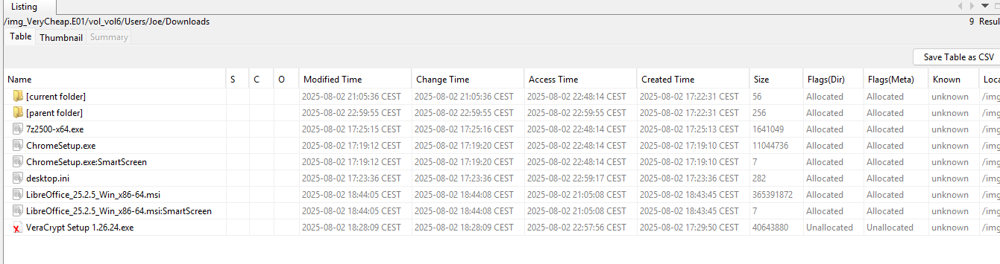
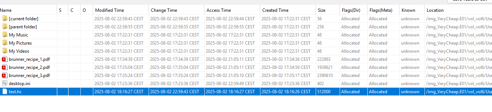
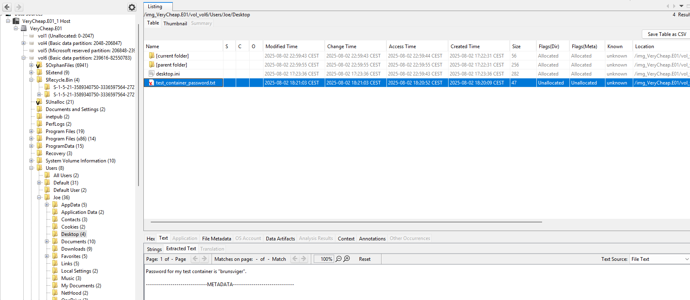
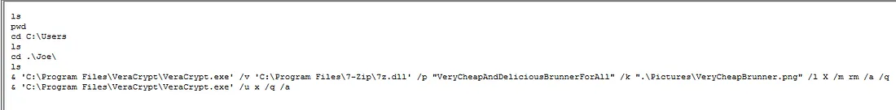
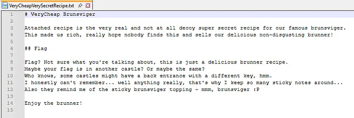
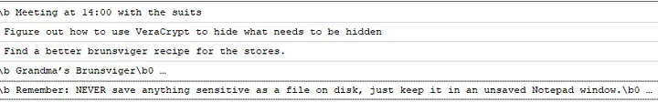
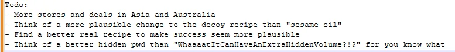
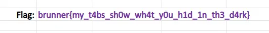

## Scenario 

In 2025, a new bakery chain called VeryCheap has taken Denmark by storm, selling their brunsviger at suspiciously low prices and driving independent bakeries out of business.
But behind the sugary facade, something doesn't add up. They must be losing money with such low prices - and why are so many of their customers in suits?

A recent police raid seized one of their office PCs. Your task: perform a full forensic analysis of the disk and find what VeryCheap is really hiding!

## Solution

In this challenge we have a disk image, and as the description hints, our task was to analyze it thoroughly and uncover what VeryCheap was really hiding.

I used Autopsy to open the disk file. 

### Stored Files

I found this information: 





- `Documents`: A few brunner recipes and a `test.hc` file - the default extension for VeraCrypt containers
- `Downloads`: Installers for 7-Zip, Google Chrome, and LibreOffice
- `Pictures`: A few downloaded brunsviger images from the internet with Zone.Identifier files (Mark Of The Web). Also a seemingly generated image of a VeryCheap bakery, `VeryCheapBrunner.png`.

In addition, there are deleted files. The recycle bin has a few files that also point to the original locations.
With most forensic tools, the files and their content can also be seen when navigating to their original location, just marked deleted:

- `C:\Users\Joe\Downloads\VeraCrypt Setup 1.26.24.exe`
- `C:\Users\Joe\Desktop\test_container_password.txt`



```bash
Password for my test container is "brunsviger".

------------------------------METADATA------------------------------
```

### Explanation

The next step was to download VeraCrypt and attempt to open the previously discovered container file, *test.hc*, using the recovered password. With "brunsviger" as the password, I successfully mounted the volume and accessed its contents. Inside, I found a text file, which, unfortunately, turned out to be a decoy rather than the actual secret.

Not discouraged, I continued investigating and recalled that VeraCrypt can also be used via the command line. This prompted me to examine the PowerShell history for any potentially useful commands.

I checked the following path:
`C:\Users\Joe\AppData\Roaming\Microsoft\Windows\PowerShell\PSReadline\ConsoleHost_history.txt`



After extracting the necessary files from the disk, I returned to VeraCrypt and used the recovered password and keyfile to mount the hidden container. Inside, I found four files, but the one that stood out — and ultimately proved useful — was *VeryCheapVerySecretRecipe.txt*.



From the text file, we obtained two key hints. The first — “that’s why I keep so many sticky notes around” — pointed us toward examining Sticky Notes artifacts on the disk. The second — “some castles might have a back entrance with a different key” — hinted that the same VeraCrypt container could potentially be unlocked again using a different password stored elsewhere.

Following this lead, I navigated to the Sticky Notes storage location at:
`C:\Users\Joe\AppData\Local\Packages\Microsoft.MicrosoftStickyNotes_8wekyb3d8bbwe\LocalState\plum.sqlite`.



When I opened the file, I found another useful hint hidden within the notes that could lead to more information about the encrypted container.

One line stood out: *“Never save anything sensitive as a file on disk, just keep it in an unsaved Notepad window.”* This pointed us directly toward investigating Notepad’s unsaved or recovery data, as Notepad automatically stores unsaved content for recovery when reopened.

Following this clue, I navigated to the Notepad recovery data location:
`C:\Users\Joe\AppData\Local\Packages\Microsoft.WindowsNotepad_8wekyb3d8bbwe`.



While examining the Notepad artifact, I came across a clue referencing VeraCrypt’s Hidden Volume feature. For context, a hidden volume is essentially a secret container embedded within a standard VeraCrypt volume. Both share the same file, but entering one password unlocks the decoy outer volume, while a different password reveals the hidden inner volume. This design supports plausible deniability — allowing a user to disclose the outer password without exposing the existence of the hidden data.

At the end of the Notepad file, I found the line:
*WhaaaatItCanHaveAnExtraHiddenVolume?!?*

This was clearly intended as the password for the hidden volume.

With this new password, I was able to unlock the hidden container. Inside, I found an Excel file — and that’s where the real flag was stored.


