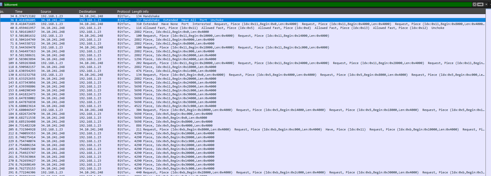
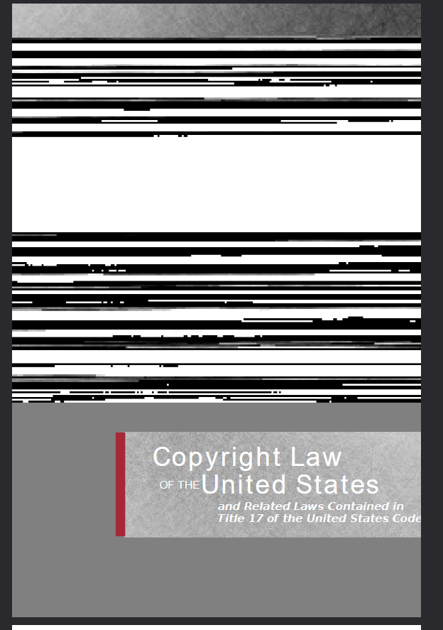

## Scenario 

NASA received a notification from their ISP that it appeared that some copyrighted files were transferred to and from the ISS (Guess astronauts need movies too). We weren't able to recover all of the files, but we were able to capture some traffic from the final download before the user signed off. If you can help recover the file that was downloaded perhaps you can shed some light on what they were doing?

## Solution

First, I use this filter on wireshark:

```bash
bittorrent
```



BitTorrent transfers files in pieces (chunks). Each piece has:

Piece Index: Identifies which piece of the file
Begin Offset: Position within that piece
Data: The actual file content

We need to identify and extract piece messages (message type 7).

```bash
tshark -r evidence.pcapng -Y "bittorrent.msg.type == 7" -T fields -e bittorrent.piece.index -e bittorrent.piece.begin -e bittorrent.piece.length
```

This shows we have pieces with indices from 0x00 to 0x14 (21 pieces total), with each piece divided into 16KB chunks (0x4000 bytes).

Initially attempting to extract all piece data in order fails:

```bash
tshark -r evidence.pcapng -Y "bittorrent.msg.type == 7" -T fields -e bittorrent.piece.data > piece_data.hex
xxd -r -p piece_data.hex > extracted_file.pdf
```

This produces a corrupted PDF because BitTorrent pieces arrive in random order, not sequentially.



The key insight is that BitTorrent pieces must be reassembled in the correct order:

Sort by piece index (0x00, 0x01, 0x02, etc.)
Within each piece, sort by begin offset (0x0000, 0x4000, 0x8000, etc.)

## Solution

```python
#!/usr/bin/env python3
import subprocess
import binascii
import sys

def extract_pieces():
    """Extract all BitTorrent pieces with their metadata"""
    cmd = [
        'tshark', '-r', 'evidence.pcapng',
        '-Y', 'bittorrent.msg.type == 7',
        '-T', 'fields',
        '-e', 'bittorrent.piece.index',
        '-e', 'bittorrent.piece.begin', 
        '-e', 'bittorrent.piece.data'
    ]
    
    result = subprocess.run(cmd, capture_output=True, text=True)
    if result.returncode != 0:
        print(f"Error running tshark: {result.stderr}")
        return {}
    
    pieces = {}
    for line in result.stdout.strip().split('\n'):
        if not line.strip():
            continue
            
        parts = line.split('\t')
        if len(parts) >= 3:
            piece_idx = int(parts[0], 16)
            begin_offset = int(parts[1], 16) 
            piece_data = parts[2]
            
            if piece_idx not in pieces:
                pieces[piece_idx] = {}
            
            pieces[piece_idx][begin_offset] = piece_data
    
    return pieces

def reassemble_file(pieces):
    """Reassemble pieces into complete file"""
    complete_data = b""
    
    # Sort pieces by index
    for piece_idx in sorted(pieces.keys()):
        print(f"Processing piece {piece_idx:02x}")
        piece_data = b""
        
        # Sort offsets within each piece
        for offset in sorted(pieces[piece_idx].keys()):
            hex_data = pieces[piece_idx][offset]
            if hex_data:  # Skip empty data
                try:
                    chunk = binascii.unhexlify(hex_data)
                    piece_data += chunk
                    print(f"  Offset {offset:06x}: {len(chunk)} bytes")
                except Exception as e:
                    print(f"  Error decoding offset {offset:06x}: {e}")
        
        complete_data += piece_data
    
    return complete_data

def main():
    print("Extracting BitTorrent pieces...")
    pieces = extract_pieces()
    
    if not pieces:
        print("No pieces found!")
        return
    
    print(f"Found {len(pieces)} pieces")
    for idx in sorted(pieces.keys()):
        print(f"Piece {idx:02x}: {len(pieces[idx])} chunks")
    
    print("\nReassembling file...")
    complete_data = reassemble_file(pieces)
    
    print(f"Total reassembled size: {len(complete_data)} bytes")
    
    # Write to file
    with open('reassembled_file.bin', 'wb') as f:
        f.write(complete_data)
    
    print("Saved as reassembled_file.bin")
    
    # Try to identify file type
    if complete_data.startswith(b'%PDF'):
        print("File appears to be a PDF!")
        with open('reassembled_file.pdf', 'wb') as f:
            f.write(complete_data)
        print("Also saved as reassembled_file.pdf")

if __name__ == "__main__":
    main()
```


~ Carbo